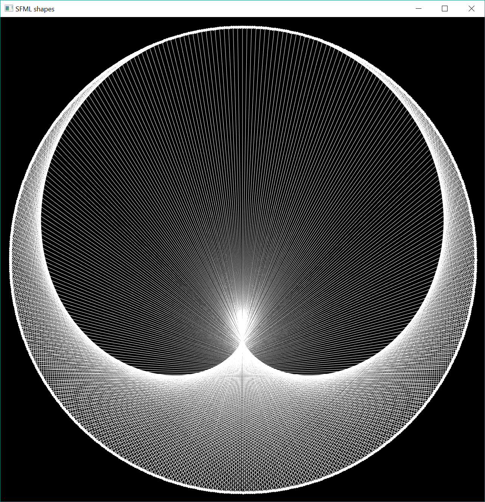

# sfml-cardioid

Documentation for this project will get automatically generated and can be found at 
https://fliegwerk.gitlab.io/sfml-cardioid/documentation/html/ (please note that the docs use JavaScript from a CDN 
site, so keep the privacy-related topics in mind when opening the site).

This project was inspired by a [coding train video](https://www.youtube.com/watch?v=bl3nc_a1nvs) and implements the 
Time Tables Cardioid pattern (a mathematical problem) in C++/SFML.

## Running the project
The project has CMake completely setup, meaning you can easily run it by opening it in your preferred IDE and 
configuring the CMake project.

In the `main.cpp` file, you can find `window_size` and `count`, with which you can manipulate setting of the project.

`window_size` determines the width and height of the (square) window. By default, it's `1280`, corresponding to 1280px.

`count` determines the amount of lines / divisions of the circle present in the project. This can be adjusted to fit 
one's needs. It should be noted, however, that the time it takes to render a frame is linearly proportional to this 
number, and too many lines can mean worse results (since the limited amount of pixels and anti-aliasing decrease the 
quality of the image). Therefore, choosing this value is a balancing and there is no "correct" value (although even 
numbers work significantly better).

## Contributors
Contributors so far include:
- @pklaschka (Main project contributor)
- @lrichter (CMakeLists.txt)
